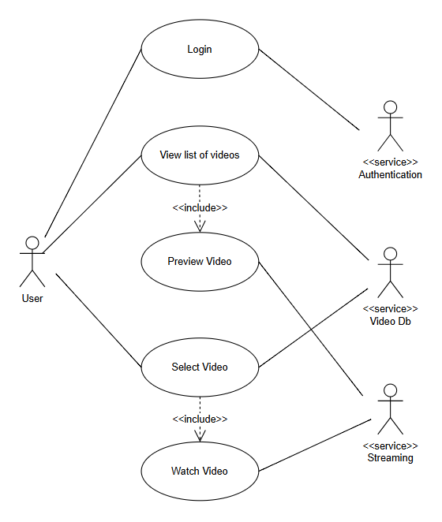

# Software Testing Essentials Certificate

[STEC Home](README.md)

## Module 7 Lesson 3: Explore tools and techniques for system analysis

Out of the methods discussed, I have good experience of many:
- **UML Diagrams:** Whilst obviously I can't share any that I've worked on (I don't have access and private information), as a team of 2-4 we used to create a UML diagram for each project that I worked on during my 5 years in development. Each project was typically 2-3 months long so over that period I've been involved in many, sometimes as creator and sole contributor.
- **Data Flow Diagrams:** Through threat modelling I have created numerous diagrams. As some examples, for TestBash UK 2022 I created DFDs for [a simple activity session](ExistingResources\DFD-WeAreAngry-2022.pdf) and [a 99 minute workshop)[ExistingResources\DFD-ThreatModelingWorkshop.drawio.pdf].
- **Mind Maps:** Not used as much, especially for modelling a system.
- **Use Case Diagrams:** Not used the diagrams but during my time in development I would create Use Case Model (UCM) documents, which included the previously mentioned UML diagrams.
- **Swimlane Diagrams:** This was a useful way of modelling the business workflows when creating a software licensing system.
- **Whiteboarding:** This was a regular activity when I was a developer. It became less popular within groups down the line but I did re-introduce it when mentoring interns.
- **Root Cause Analysis (RCA):** I've done a lot of this. Check out my series of [blog posts on Meaningful RCAs](https://www.r-adams.co.uk/resources/meaningful-rcas/).
- **Risk Assessment:** I've done this in a number of ways from risk storming through to SFDIPOT and just brainstorming.
- **Persona Mapping:** Personas were a useful tool for my stint as a Quality Coach. I created a series of personas that we could use in refinement, testing and demos.

### Activity: Mapping the system

I didn't complete this exercise exactly as described because I've experience with the techniques described, some of which were required as part of my role (see above).

Even without creating a new diagram, I could answer the reflection. The act of modelling out systems for data flow diagrams when threat modelling was really powerful in challenging our understanding of the system. It makes me think about the different components, what interacts with what and also the different data involved, trust boundaries in place and different data stores (including more than databases!).

When asked in an interview about how I would learn the system to get up to speed, modelling it was my immediate answer.

**The Actual Activity**

As mind maps and DFDs are very familiar, I ruled them out and whilst I've worked with Use Case Models, we didn't include UCDs (instead had UML diagrams)so went with this. As with another recent activity, I used the video streaming service (thinking Netflix, Youtube etc).

I found this a little tough to be honest. I suspect I've gotten it wrong, even after diving into more details on them. I could see it being a nice way to represent a Use Case Model but without that, it wasn't that straightforward or even useful.

I think to represent the flow of behaviours with the different actors, I'd definitely prefer using swimlanes (used them in the past) as a way to model out the system. That said, if I had a UCM then the UCD would be a simple nice addition.
