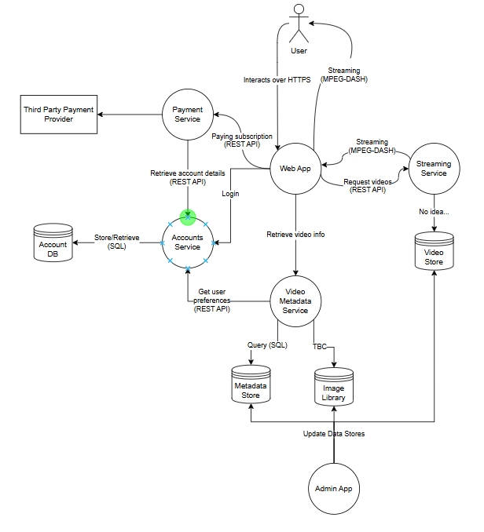
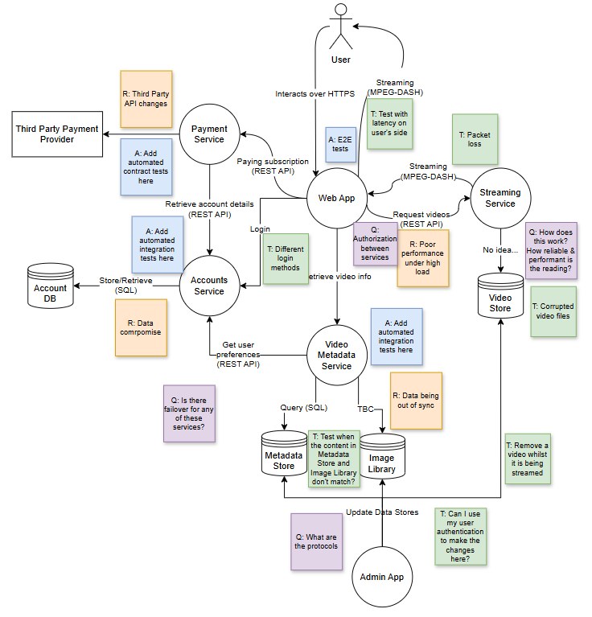

# Software Testing Essentials Certificate

[STEC Home](README.md)

## Module 7 Lesson

For these activities I have continued with a fictional video streaming service.

### Activity 1: Flow Diagram

Interestingly my flow diagram didn't really highlight the areas where I believe the greatest risks live. The one thing that I think it did show was that it is easy to get stuck in a loop of scrolling, which is really true from my experience!!!

With the amount of user activity in browsing, filtering and searching it does highlight the importance of this being important and a good UX (although from my experience of real apps, this isn't great). As people move through the app, I'd be curious to see how their preferences and filters are retained, if they are.

### Activity 2: Data Flow Diagram

I'm going to cheat and skip this exercise. I've created dozens of DFDs down the years. Here are a couple that I've shared beforehand:

- ["We Are Angry" for activity session](ExistingResources\DFD-WeAreAngry-2022.pdf)
- [More advanced "We Are Angry" for multiple uses](ExistingResources\DFD-WeAreAngry-2023.pdf)
- ["Government Test Results System" for a talk & workshop](ExistingResources\DFD-ThreatModelingWorkshop.drawio.pdf].

(For obvious reasons, I can't include diagrams for real projects)

### Activity 3: Pulling it all together

List the key parts: Identify the main components of the system (e.g., users, data, notifications).
Map out the connections: Think about how these parts might interact. 
Build a model: Use a method that makes sense to you.
Testing ideas: Use your model to come up with three testing ideas. 
Consider:
What risks can you identify in the interactions between parts?
Where might failures occur under certain conditions?
How does the system handle unexpected inputs or scenarios?
Add your model, testing ideas, and reflections to your portfolio.

#### Key Components

- Users
  - Devices: Browser / TV / Mobile
  - Account DB (Users DB)
  - Accounts Service
  - Payment Service
  - UI
- Selecting Videos
  - Video Metadata Service
  - Video Metadata DB
  - Image Library
  - UI
- Viewing Videos
  - Video File Store
  - Streaming Service

There's also going to be an administration side to this to add and update content.

#### Creating a model

A lot of the time I'd have just used sticky notes or simple shapes but I used a proper diagramming tool and kind of went with a style similar to data flow diagrams but some clearer objects for data stores (DB looking icon) and the user (picked UML actor).

#### Risks & Tests

When doing this in practice, I like using sticky notes of different colours to show the risks, test ideas and also questions. Highlighting key automation tests can also be useful.

#### Reflections

Modelling a system is a really powerful tool. Clearly there is no one correct modelling approach given that some are better at highlighting user flows and behaviours whilst others better articulate and help us understand the architecture and interactions between components.

### Activity 4: Revisit and refine your systems thinking definition

I've intentionally not updated the definition that I created in [Lesson 1](Lesson-7-1.md). Instead I've an updated version with an extra line on the end.

Systems thinking is where we consider the different components and how they interact together. We aren't fixated on just the component that has changed, nor are we ignoring the nuances and behaviours of individual components to focus on the whole system. When something changes in one service, we look at all the impacted services and consider them. We view the system as a whole but think about everything involved within it. *It requires the ability to zoom out and see the full picture but still understand what is going on when we zoom in. Modelling is a great tool to help us achieve this.*